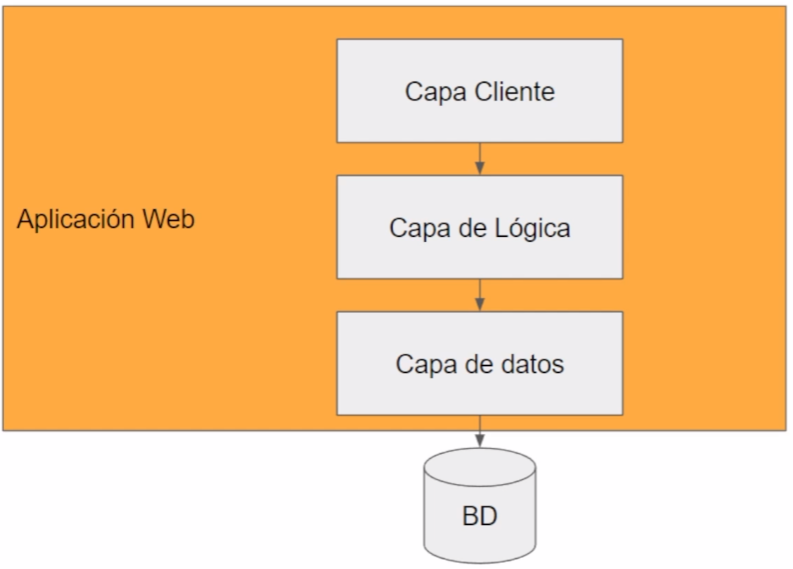
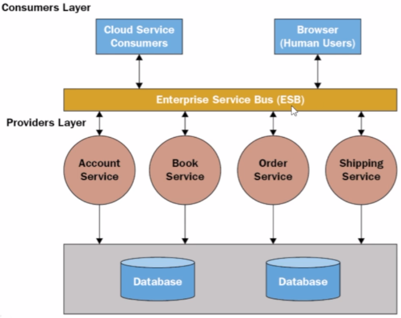
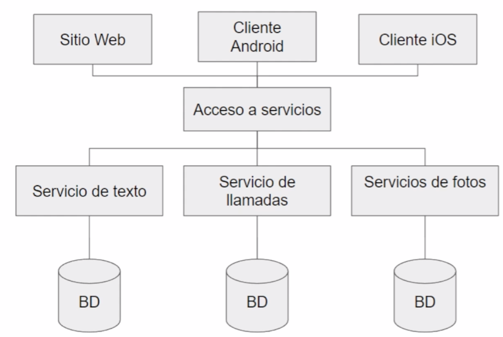
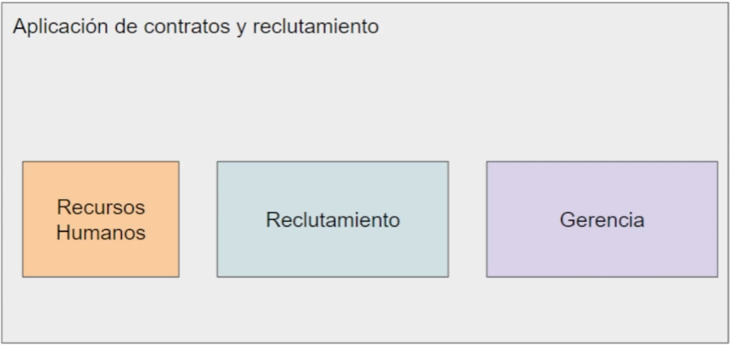
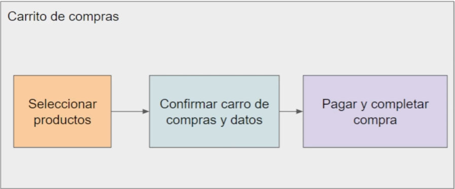
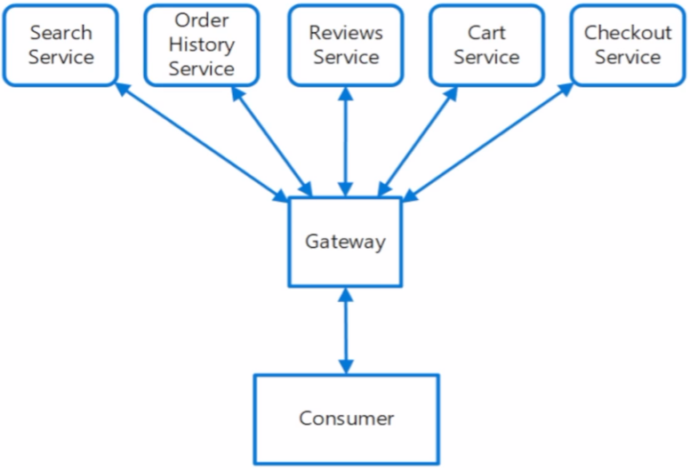

# Introducción a la arquitectura de microservicios

## Aplicaciones monolíticas

Características:

* Los componentes y módulos están conectados en un mismo programa, todos los componentes son importantes para que la aplicación funcione.
* Es una aplicación autónoma que no depende de componentes externos, todas las funcionalidades se encuentran dentro de la aplicación. 
* Normalmente el backend y el frontend están en la misma solución, lo más tradicional es utilizar un framework fullstack como Laravel.
* Se suele implementar separación de capas, módulos o bibliotecas dependientes dentro de la aplicación.
* Es la arquitectura más tradicional para diseñar aplicaciones.

### Monolitos

Los ***monolitos*** son aplicaciones desarrolladas bajo una arquitectura monolítica.

Acerca de:

* No es un antipatrón (es una arquitectura válida).
* Es una buena arquitectura para soluciones rápidas y pequeñas.
* Es perfecta para pruebas de concepto (para ciertos escenarios).
* Permiten construir aplicaciones rápidamente.
* Funciona para el 99% de las aplicaciones pequeñas.
* Los frameworks fullsctack permiten desarrollar aplicaciones monolíticas.

Ejemplo de una aplicación monolítica:

> Una arquitectura monolitica es un buen punto para empezar una solución, posteriormente se pueden integrar microservicios, diferentes arquitecturas y patrones según las necesidades.

### Desafíos

* Son difíciles de escalar.

> El ***Scale-Up*** se refiere a aumentar los recursos del servidor donde está alojada la aplicación.
>
> El ***Scale-Out*** se refiere a utilizar diferentes ordenadores para distribuir la demanada de la aplicación.

* Los componentes del sistema son totalmente dependientes.
* Tienen poca tolerancia ante fallos.
* Alta dependencia entre los equipos de desarrollo, se necesita una muy buena coordinación sobre el trabajo que se está realizando en la aplicación.
* Son difíciles de mantener ante un crecimiento exponencial.
* La curva de aprendizaje es mayor para comprender la aplicación orientada a nuevos desarrolladores.

## Arquitectura de software y SOA

Una ***arquitectura de software*** se refiere a la relación, comunicación y estructura de los componentes en un sistema, incluye buenas prácticas y patrones comprobadas en diferentes escenarios, además nos ayudan a modelar una solución de acuerdo a nuestras necesidades.

Los servicios son aplicaciones expuestas que proveen datos o rutinas específicas para ser consumidas por otras aplicaciones, nos permiten distribuir la lógica y compartirla entre diferentes clientes.

Estándares para servicios:

* SOAP Web services
* API RESTful
* GraphQL

***SOA*** (Service Oriented Architecture) es una arquitectura donde se distribuye la lógica en servicios que luego son consumidos a través de interfaces. Los servicios normalmente están relacionados en unidades de negocios o áreas de una compañía y por su complejidad se necesita de un software orquestador (integra servicios de diversas fuentes) o administrador de servicios.

Ejemplo de una aplicación SOA:

> Un administrador de servicios es costoso.

***Microservicios es una interpretación moderna de SOA.***

## Microservicios

*Es una arquitectura orientada a servicios y a la nube que busca descomponer una aplicación en diferentes servicios para obtener alta disponibilidad, bajo acoplamiento (dependencia), descentralización y tolerancia a fallos.*

Es una arquitectura ideal para escenarios de alto tráfico (volumen de datos), alta demanda (número de peticiones) y alta disponibilidad.

Cada microservicio pude estar construido en un lenguaje y tecnología diferente.

Ejemplo de una aplicación con microservicios:

> La aplicación se divide por servicios o responsabilidades, y cada servicio cuenta con su propia base de datos.

Los microservicios resuelven los problemas a gran escala que presentan las aplicaciones monolíticas y dividen problemas complejos de gran magnitud en problemas pequeños.

## Reglas de diseño de un Microservicio

* Un microservicio debe estar aislado y debe ser autónomo (independientes).
* Cada microservicio debe tener su propio repositorio.
* Cada microservicio debe tener su propia base de datos.
* Cada microservicio debe ser desplegado de manera independiente (diferentes servidores).
* Cada microservicio debe tener una única responsabilidad.
* Un microservicio debe ser en lo posible *Stateless* (no guardar datos en caché, sesión, etc.).
* Los microservicios deben manejar tipos de datos estándar (formatos estándar).
* Deben ser ligeros y deben tener una arquitectura simple.
* Deben ser monitoreables.
* Cada microservicio se puede versionar.

## Ventajas de los Microservicios

* Alta disponibilidad en nuestras aplicaciones y pueden funcionar parcialmente (por módulos específicos).
* Cada servicio puede estar construido de manera diferente de acuerdo a las necesidades.
* Permite tener equipos distribuidos e independientes.
* Fácil de escalar.
* Desarrollo modular y progresivo.
* Alta tolerancia a fallos.
* Detección y corrección rápida de errores en muchos escenarios.

## Desafíos de los Microservicios

* Los esfuerzos para desplegar se multiplican por el número de servicios.
* La integración de servicios al desplegar la aplicación completa.
* Integridad de los datos al tener múltiples bases de datos con valores compartidos.
* Requiere profesionales, equipos y empresas de gran madurez.
* Requiere de una cultura DevOps madura y con buenas herramientas.
* Alta complejidad al manejar gran número de microservicios.
* Alta inversión de tiempo, gestión, mantenimiento y arquitectura.

## Microservicios y DevOps

* ***DevOps*** resuelve la complejidad de los despliegues en arquitecturas basadas en Microservicios.
* Microservicios es una arquitectura orientada a la nube.
* Automatización de procesos y reducción de tiempos son fundamentales.

Algunas herramientas que ayudan a desplegar microservicios:

* [Docker](https://www.docker.com/)
* [Kubernetes](https://kubernetes.io/es/)
* [Terraform](https://www.terraform.io/)
* [AWS CloudFormation](https://aws.amazon.com/es/cloudformation/)

## Opciones y estrategias de despliegue

Máquinas Virtuales:

* Se utiliza una máquina virtual para desplegar cada microservicio con su propio servidor de manera aislada.
* Es muy complejo y difícil de mantener.
* Es la opción más costosa.
* Es una opción común en tecnologías legacy (antiguas).

Servicios para APIs:

* Son servicios especializados en desplegar APIs de diferentes tecnologías.
* Se deben construir APIs RESTful tradicionales.
* [Azure App Service](https://azure.microsoft.com/es-mx/services/app-service/) es uno de los más populares.
* Estrategia Blue/Green (producción/nuevas versiones).

Serverless:

* Ejecuta piezas de código sin preocuparse por el servidor y su configuración.
* Disminuye la complejidad de implementaciones pequeñas.
* Algunos ejemplos de estos servicios: [Azure Functions](https://azure.microsoft.com/es-mx/services/functions/), [AWS Lambda](https://aws.amazon.com/es/lambda/), [Alibaba Cloud Function Compute](https://www.alibabacloud.com/es/product/function-compute).

Contenedores:

* Permite desplegar una aplicación de manera aislada.
* [Docker](https://www.docker.com/) es el más famoso.
* Existen orquestadores para escenarios avanzados y complejos.
* Es el preferido porque se tiene un alto control y bajo acoplamiento.
* Fácil de migrar a otros proveedores cloud.

> Podemos combinar diferentes estrategias para crear y desplegar Microservicios de acuerdo a nuestras necesidades.

## Estrategias de diseño en Microservicios

### Arquitectura Hexagonal

* Es una arquitectura orientada a servicios desacoplados basada en puertos y adaptadores para comunicar los diferentes microservicios.
* Permite separar las capas a través de adaptadores con su propia responsabilidad, evitando el acoplamiento de los componentes de la aplicación.
* Permite que la aplicación se use de la misma manera por cualquier usuario, programa o tarea.

Ejemplo de un arquitectura hexagonal:

### MicroApps

* Se diseñan aplicaciones con responsabilidades específicas y servicios aislados.
* Se comparten componentes entre las apps manteniendo su independencia.
* Se debe tener una integración entre los datos generados por las diferentes apps.

Ejemplo de MicroApps:

### Separación de roles

* Se definen microservicios por cada rol que se presente en la aplicación.
* Se refuerza la seguridad de acuerdo al rol y a cada microservicio.
* Se debe tener una integración de los datos generados por los diferente microservicios.

### Microservicios por núcleo de negocio

* Se identifican las diferentes unidades de negocio de la aplicación (financiera, administrativa, reclutamiento, etc).
* Se dividen las unidades de negocio en servicios.
* Se debe tener una integración entre los datos generados por los diferentes núcleos de negocio.

Ejemplo de microservicios por núcleo de negocio:

### Microservicios por flujos de trabajo

* Se identifican los pasos que realizan los usuarios y después se dividen por fases y etapas.
* Se construyen microservicios por cada flujo existente dentro de la aplicación.
* Se actualizan y mueven los datos para construir cada fase hasta finalizarlo.

Ejemplo de microservicios por flujos de trabajo:

## Patrones en Microservicios

> Los patrones son una guía para solucionar problemas o retos conocidos.

### Ambassador - Embajador

* Es uno de los patrones más utilizados en microservicios junto a la arquitectura hexagonal.
* Permite crear una capa de abstracción entre el servicio y los componentes compartidos.
* Permite consumir servicios de monitoreo, autenticación, seguridad, utilidades, etc.
* Este patrón se debe implementar en el mismo host en el que se encuentra el servicio.

Ejemplo de un patrón embajador:

### Materialized View - Vista Materializada

* Se crea una tabla en caché que se utiliza cada cierto tiempo donde los datos provenientes de las tablas originales se consolidan para que sea más fácil su lectura.
* Agiliza las consultas y mejora el performance.

### Event sourcing

* Manipula las diferentes acciones de la aplicación como eventos.
* Gestiona los cambios que se presentan en la aplicación utilizando eventos.
* Las operaciones normales de un CRUD se convierten en eventos.
* Se utiliza un bus de eventos para llevar el control y el historial, como [RabbitMQ](https://www.rabbitmq.com/) o [Apache Kafka](https://kafka.apache.org/).

Ejemplo de un patrón por eventos:

### Otros patrones

* Retry
* Sidecar
* Priority Queue
* Anti-Corruption Layer
* Saga
* API Gateway

## Patrón API Gateway

* Permite extraer toda la capa de servicios a través de una única puerta de acceso, es decir, una URL única para exponer todos los microservicios.
* Permite exponer los endpoints de manera independiente aumentando su seguridad.
* Permite cambiar y reorganizar los servicios sin afectar las aplicaciones cliente.

Ejemplo de un patrón por API Gateway:

## Patrón Saga

* Permite administrar transacciones (secuencia de acciones).
* Cada transacción actualiza la base de datos o publica un evento para que continúe el siguiente.
* Se manejan transacciones de compensación para realizar acciones opuestas para realiza un rollback (devolver lo que se hizo).

Ejemplo de un patrón por Saga:

## Referencias

* <https://microservices.io/>
* [Definición de un orquestador de servicios.](http://orquestador.cl/)
* Data webhouse - Consolida los datos de múltiples bases de datos en una sola.
* [Patrones de diseño en la nube.](https://docs.microsoft.com/es-es/azure/architecture/patterns/)
